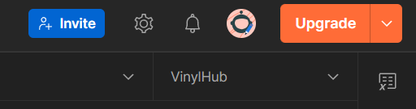
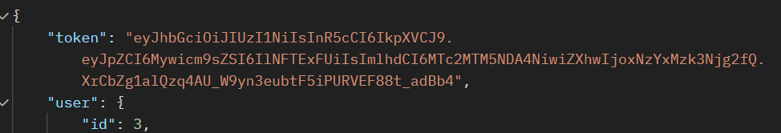

# 🎵 VinylHub API

VinylHub — це RESTful API-платформа для керування вініловими платівками, оголошеннями, колекціями 
та платежами між колекціонерами та продавцями.

## Технології
- **Node.js + Express** — серверна частина
- **Sequelize ORM** — робота з базою даних
- **PostgreSQL** — основна база
- **SQLite (in-memory)** — тестова база
- **JWT + bcrypt** — авторизація та шифрування
- **nodemailer** — надсилання email-сповіщень
- **Vitest** — автоматизовані тести

---

## Встановлення

1. **Клонувати репозиторій (або встановити архів)**
   ```bash
   git clone https://github.com/xrendezvous/vinylhub_ooad.git
   cd vinylhub_api

2. **Встановити залежності**
    ```bash
   npm install

3. **Створити .env файл (вказати свої дані для бази даних)**

   NODE_ENV=test
   PORT=3000
   DB_NAME=vinylhub_db
   DB_USER=postgres
   DB_PASS=your_password
   DB_HOST=db
   JWT_SECRET=super_secret_key
   SMTP_USER=vinylhub_platform@ukr.net
   SMTP_PASS=ozEe4wDlavt5WFyA

4. **Очистити старі volume**
   Потрібно це робити перед першим білдом контейнера
   ```bash
   docker-compose down -v

5. **Запустити через Docker**
    ```bash
   docker compose up --build
   
6. **Запуск тестів (усього 8 модулів та 45 тестів)**
    ```bash
   npm test
   
## POSTMAN

Для тестування в POSTMAN використовуйте файл vinylhub_api.json
Його можна імпортувати на платформу, де будуть доступні всі запити.
Перед тестуванням необхідно створити середовище та вказати там дві змінні: 
token_seller та token_collector. 


Після запитів на логін для колекціонера та продавця
присвойте значення цим змінним, які вам видасть результати запиту (поле token).



